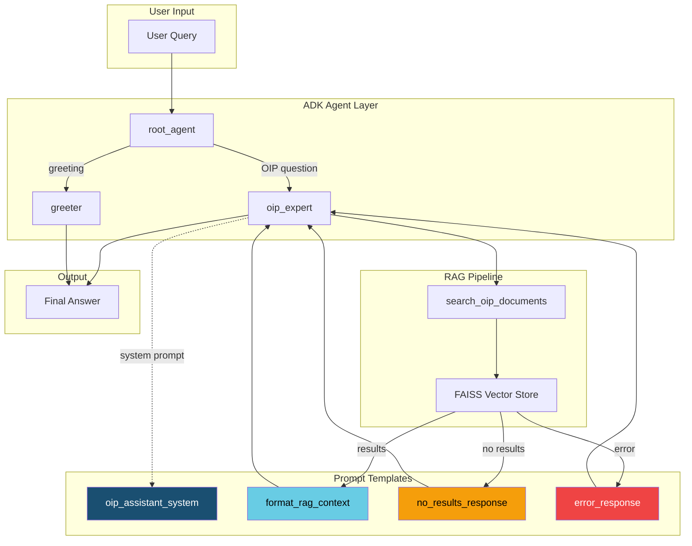

# Prompts Documentation

This document explains all prompt templates in `my_agent/prompts/templates.py` and how they integrate with the system.

---

## Prompt Flow Diagram



---

## Quick Reference Table

| Prompt Function | Used By | Purpose | Edit For |
|-----------------|---------|---------|----------|
| `oip_assistant_system()` | `agent.py` → oip_expert | Main system prompt | Response style, length, persona |
| `format_rag_context()` | `rag_tool.py` | Formats retrieved docs | Context structure |
| `no_results_response()` | `rag_tool.py` | Empty results message | Fallback behavior |
| `error_response()` | `rag_tool.py` | Error message | Error handling UX |
| `rag_qa_prompt()` | Optional/External | Standalone QA | Direct LLM calls |
| `rag_qa_with_history()` | Optional/External | Multi-turn QA | Conversation memory |
| `query_rewrite_prompt()` | Optional | Query preprocessing | Advanced retrieval |
| `query_expansion_prompt()` | Optional | Fusion retrieval | Multi-query search |
| `query_classification_prompt()` | Optional | Intent detection | Adaptive routing |
| `summarize_chunk_prompt()` | Optional | Chunk summarization | Long doc handling |
| `synthesize_documents_prompt()` | Optional | Multi-doc synthesis | Aggregation |
| `extract_data_prompt()` | Future | Data extraction | Charts/visualization |

---

## Detailed Prompt Descriptions

### 1. `oip_assistant_system()` - **MAIN PROMPT**

**Location:** `my_agent/prompts/templates.py`
**Called By:** `my_agent/agent.py` → `oip_expert` agent
**Purpose:** Controls the overall behavior, tone, and output format of the assistant.

```
User Query → root_agent → oip_expert (uses this prompt) → Response
```

**What to edit here:**
- Response length (currently: 3-5 sentences max)
- Tone/persona (currently: friendly and concise)
- Language handling (currently: responds in user's language)
- Output formatting rules

**Current settings:**
```python
<OUTPUT_FORMAT>
- Keep responses SHORT and to the point (3-5 sentences max)
- Use bullet points only when listing 3+ items
- No lengthy introductions - get straight to the answer
- One paragraph for simple questions, brief bullets for complex ones
- Avoid repeating the question back
</OUTPUT_FORMAT>
```

---

### 2. `format_rag_context()`

**Location:** `my_agent/prompts/templates.py`
**Called By:** `my_agent/tools/rag_tool.py` → `search_oip_documents()`
**Purpose:** Formats retrieved FAISS results into structured XML for the LLM.

```
FAISS Results → format_rag_context() → Formatted XML → LLM
```

**Output format:**
```xml
<RETRIEVED_CONTEXT query="user query" num_results="5">
  <DOCUMENT rank="1" source="SOW.pdf" relevance="0.85">
    Document text here...
  </DOCUMENT>
  ...
</RETRIEVED_CONTEXT>
```

**What to edit here:**
- Include/exclude relevance scores
- Change XML tag structure
- Add metadata fields

---

### 3. `no_results_response()`

**Location:** `my_agent/prompts/templates.py`
**Called By:** `my_agent/tools/rag_tool.py`
**Purpose:** Returned when FAISS finds no matching documents.

**Current message:**
```
I searched the OIP documentation but couldn't find specific information about "{query}".

Possible reasons:
1. The topic isn't covered in the current documentation
2. Try rephrasing with different terms
3. The information might be in a document not yet indexed

Would you like me to help rephrase your question?
```

---

### 4. `error_response()`

**Location:** `my_agent/prompts/templates.py`
**Called By:** `my_agent/tools/rag_tool.py`
**Purpose:** Returned when an error occurs (API failure, index error, etc.)

---

### 5-12. Optional/Future Prompts

These are **not currently used** but available for advanced features:

| Prompt | Use Case |
|--------|----------|
| `rag_qa_prompt()` | Direct LLM calls without ADK |
| `rag_qa_with_history()` | Multi-turn conversations |
| `query_rewrite_prompt()` | Query preprocessing |
| `query_expansion_prompt()` | Generate query variants |
| `query_classification_prompt()` | Detect query intent |
| `summarize_chunk_prompt()` | Summarize long chunks |
| `synthesize_documents_prompt()` | Combine multiple docs |
| `extract_data_prompt()` | Extract data for charts |

---

## How to Customize Responses

### Make Responses Shorter

Edit `oip_assistant_system()`:
```python
<OUTPUT_FORMAT>
- Maximum 2-3 sentences per response
- No bullet points unless absolutely necessary
- Direct answers only
</OUTPUT_FORMAT>
```

### Make Responses More Detailed

Edit `oip_assistant_system()`:
```python
<OUTPUT_FORMAT>
- Provide comprehensive explanations
- Use bullet points for clarity
- Include examples where helpful
- 1-2 paragraphs for complex topics
</OUTPUT_FORMAT>
```

### Change Persona

Edit the `<PERSONA>` section:
```python
<PERSONA>
You are a technical expert who speaks formally and precisely.
</PERSONA>
```

### Add Language-Specific Behavior

Edit `<INSTRUCTIONS>`:
```python
<INSTRUCTIONS>
- If query is in Arabic, respond in formal Arabic
- If query is in English, use professional English
- Support code-switching (mix of both)
</INSTRUCTIONS>
```

---

## Data Flow Summary

```
1. User sends query
2. root_agent routes to oip_expert (or greeter)
3. oip_expert loads oip_assistant_system() as system prompt
4. oip_expert calls search_oip_documents tool
5. Tool queries FAISS index
6. Results formatted via format_rag_context()
7. LLM generates response following OUTPUT_FORMAT rules
8. Response returned to user
```

---

## File Locations

```
my_agent/
├── agent.py              # Uses oip_assistant_system()
├── prompts/
│   └── templates.py      # All prompt definitions
└── tools/
    └── rag_tool.py       # Uses format_rag_context(), no_results_response(), error_response()
```

---

## Testing Changes

After editing prompts:

1. No code changes needed - prompts are loaded at runtime
2. Restart the agent: `adk web my_agent`
3. Test with sample queries
4. Iterate on prompt wording

---

## Best Practices

1. **Be specific** - Vague instructions lead to inconsistent outputs
2. **Use constraints** - "Maximum 3 sentences" works better than "be concise"
3. **Test edge cases** - Try Arabic, typos, ambiguous queries
4. **Version control** - Commit prompt changes with clear messages
5. **Document changes** - Note why you changed a prompt
