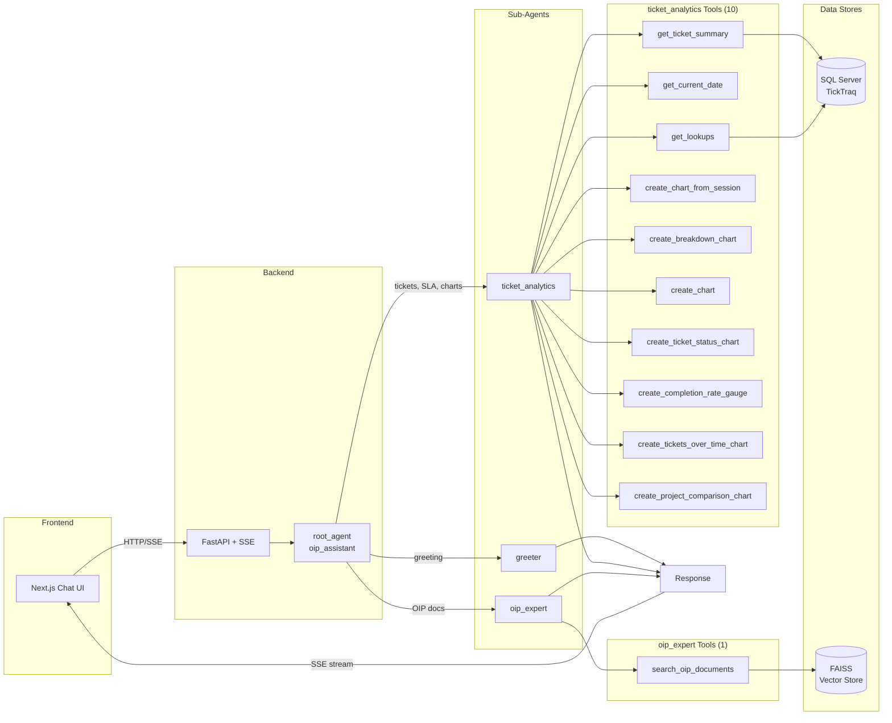

# Ebttikar OIP Assistant

A RAG-powered chatbot for the Ebttikar Operations Intelligence Platform (OIP) built with Google Agent Development Kit (ADK).

## Overview

A full-stack multi-agent chatbot for the Operations Intelligence Platform (OIP) and TickTraq ticket management system. The system combines RAG-based document Q&A, real-time ticket analytics from SQL Server, and interactive Recharts visualizations, all served via SSE streaming through a FastAPI backend.

### Key Features

- **Multi-Agent Architecture**: 1 root agent + 3 sub-agents (greeter, oip_expert, ticket_analytics)
- **Ticket Analytics**: Real-time ticket data from SQL Server via stored procedures with SLA tracking
- **Interactive Charts**: Recharts-based visualizations (pie, bar, gauge, line) rendered in the frontend
- **Document-based Q&A (RAG)**: Answers OIP questions using FAISS vector search over SOW.pdf and OIP docs
- **SSE Streaming**: Real-time status updates as agents process requests
- **Bilingual Support**: English and Arabic greetings
- **FAQ System**: Interactive categorized FAQ with 7 categories and 16 questions
- **Google ADK**: Agent orchestration with tool chaining and session state

---

## Architecture

```
┌──────────────────────────────────────────────────────────────────────┐
│                 Frontend (Next.js + React 19 + Recharts)             │
│         Pages: Login, Home, Full Chat + Floating Widget + FAQ        │
└──────────────────────────────────────────────────────────────────────┘
                                │
                     HTTP / Streaming SSE (port 8080)
                                │
┌──────────────────────────────────────────────────────────────────────┐
│                    Backend (FastAPI + Google ADK)                     │
│                                                                      │
│  ┌────────────────────────────────────────────────────────────────┐  │
│  │            root_agent (oip_assistant) - Coordinator            │  │
│  │   Routes: Greetings → greeter                                 │  │
│  │           Ticket queries → ticket_analytics                   │  │
│  │           OIP questions → oip_expert                          │  │
│  └────────────────────────────────────────────────────────────────┘  │
│         │                    │                        │              │
│         ▼                    ▼                        ▼              │
│  ┌────────────┐   ┌──────────────────┐   ┌────────────────────┐     │
│  │  greeter   │   │ ticket_analytics │   │    oip_expert      │     │
│  │(Greetings) │   │ (DB + Charts)    │   │    (RAG Q&A)       │     │
│  │ No tools   │   │ 10 tools         │   │ 1 tool             │     │
│  └────────────┘   └──────────────────┘   └────────────────────┘     │
│                      │            │                  │               │
│               ┌──────┘            └──────┐           │               │
│               ▼                          ▼           ▼               │
│      ┌─────────────────┐     ┌──────────────┐  ┌──────────────┐     │
│      │   SQL Server     │     │ Chart Tools  │  │ FAISS Index  │     │
│      │   (TickTraq)     │     │ (Recharts)   │  │ (Vector DB)  │     │
│      │                  │     │              │  │              │     │
│      │ Stored Procedure │     │ Pie, Bar,    │  │ OpenRouter   │     │
│      │ usp_Chatbot_     │     │ Gauge, Line  │  │ Embeddings   │     │
│      │ GetTicketSummary │     │              │  │              │     │
│      └─────────────────┘     └──────────────┘  └──────────────┘     │
└──────────────────────────────────────────────────────────────────────┘
```

### Agent Routing (Mermaid)



> **See [PROMPTS.md](PROMPTS.md) for detailed prompt documentation and customization guide.**

---

## Directory Structure

```
Ticketing Chatbot/
├── .env                      # API keys (OPENROUTER, GOOGLE, TAVILY)
├── main.py                   # FastAPI server (SSE streaming, 5 endpoints)
├── requirements.txt          # Python dependencies
├── README.md                 # This file
├── PROMPTS.md                # Prompt templates documentation
├── IMPLEMENTATION_PLAN.md    # Detailed implementation plan
│
├── docs/                     # Knowledge base + documentation
│   ├── SOW.pdf               # Statement of Work
│   ├── Ebttikar_OIP_doc.docx # OIP documentation
│   └── API_REFERENCE.md      # Full API documentation for OIP integration
│
├── data/
│   └── faiss_index/          # Persisted vector index
│       ├── index.faiss       # FAISS index file
│       └── metadata.json     # Chunk metadata and texts
│
├── scripts/
│   └── ingest_documents.py   # CLI to ingest docs into FAISS
│
└── my_agent/                 # Main agent package
    ├── __init__.py           # Exports root_agent
    ├── agent.py              # Root agent + greeter + oip_expert definitions
    ├── config.py             # Centralized configuration
    ├── models.py             # Pydantic data models
    │
    ├── agents/               # Sub-agent definitions
    │   ├── __init__.py
    │   ├── ticket_analytics.py  # Ticket analytics agent (10 tools)
    │   └── data_visualization.py # Unused (merged into ticket_analytics)
    │
    ├── prompts/              # Prompt templates
    │   ├── __init__.py
    │   └── templates.py      # All prompts with f-string parameters
    │
    ├── helpers/              # Reusable utility functions
    │   ├── __init__.py
    │   ├── openrouter.py     # OpenRouter API client (embeddings, LLM)
    │   └── document_loader.py# PDF/DOCX text extraction
    │
    ├── rag/                  # RAG components
    │   ├── __init__.py
    │   ├── chunker.py        # Semantic document chunking
    │   └── vector_store.py   # FAISS index operations
    │
    └── tools/                # Agent tools (13 total)
        ├── __init__.py
        ├── rag_tool.py       # search_oip_documents (FAISS search)
        ├── db_tools.py       # get_ticket_summary, get_current_date,
        │                     # create_chart_from_session, get_lookups
        └── chart_tools.py    # create_chart, create_ticket_status_chart,
                              # create_completion_rate_gauge,
                              # create_tickets_over_time_chart,
                              # create_project_comparison_chart,
                              # create_breakdown_chart
```

### Why This Structure?

| Directory | Purpose |
|-----------|---------|
| `agents/` | Sub-agent definitions - ticket_analytics with ReAct prompting |
| `prompts/` | Isolated prompt templates - easy to modify without touching code |
| `helpers/` | Reusable functions (API clients, loaders) - no duplication |
| `rag/` | RAG-specific components - chunking, embeddings, retrieval |
| `tools/` | Agent tools - RAG search, DB queries, chart generation |
| `scripts/` | CLI utilities - ingestion, maintenance scripts |

---

## Setup

### Prerequisites

- Python 3.10+ (tested on 3.12)
- OpenRouter API key
- Google API key (for Gemini)

### 1. Clone and Navigate

```bash
git clone https://github.com/Areeb297/oip_chat_agent.git
cd oip_chat_agent
```

---

### 2. Create Environment (Choose One)

#### Option A: Python venv (if Python is installed)

```bash
# Windows
python -m venv venv
venv\Scripts\activate

# Linux/Mac
python -m venv venv
source venv/bin/activate
```

#### Option B: Conda (if Conda/Miniconda is installed)

```bash
# Create environment with Python 3.12
conda create -n oip_agent python=3.12 -y

# Activate environment
conda activate oip_agent

# Verify Python version
python --version
```

**Conda useful commands:**
```bash
# List all environments
conda env list

# Deactivate environment
conda deactivate

# Remove environment (if needed)
conda env remove -n oip_agent
```

---

### 3. Install Dependencies

```bash
# Works for both venv and conda
pip install -r requirements.txt
```

> **Note:** Conda environments include pip by default. Use pip for installing from requirements.txt.

### 4. Configure Environment

Create or verify `.env` file:

```env
# Required
GOOGLE_API_KEY=your_google_api_key
OPENROUTER_API_KEY=your_openrouter_api_key

# Optional
USE_OPENROUTER=false              # Set to "true" to use OpenRouter/Grok instead of Gemini
TAVILY_API_KEY=your_tavily_api_key

# Database (defaults shown - override if your SQL Server is different)
DB_SERVER=LAPTOP-3BGTAL2E\SQLEXPRESS
DB_NAME=TickTraq
```

### 5. Ingest Documents

This processes your docs, chunks them, generates embeddings, and saves to FAISS:

```bash
python scripts/ingest_documents.py
```

Expected output:
```
============================================================
OIP Document Ingestion Pipeline
============================================================

[1/5] Validating configuration...
  OK - API keys found

[2/5] Initializing components...
  Chunk size: 500 chars
  Overlap: 50 chars

[3/5] Loading documents from docs...
Loaded: SOW.pdf
Loaded: Ebttikar_OIP_doc.docx
  Loaded 2 documents

[4/5] Chunking documents...
  Created XX chunks

[5/5] Generating embeddings...
  Batch 1/X complete
  ...

INGESTION COMPLETE
============================================================
Documents processed: 2
Chunks created: XX
Vectors stored: XX
```

### 6. Run the Agent

**Option A: FastAPI Server (for frontend integration)**
```bash
python main.py
```
Server runs at `http://localhost:8080` with SSE streaming support.

**Option B: ADK Web Interface (for direct agent testing)**
```bash
adk web my_agent
```
Opens at `http://localhost:8000`. Specify `my_agent` to prevent ADK from listing other directories.

---

## Usage

### Example Queries

**Greetings** (routed to `greeter`):
- "Hello"
- "Marhaba"
- "Hi there"

**Ticket Analytics** (routed to `ticket_analytics`):
- "What are my tickets?"
- "How many open tickets do I have for ANB?"
- "Am I on track with my tickets this month?"
- "Do I have any SLA breaches?"
- "Show me my ticket status for the Maintenance team"
- "How are my Riyadh region tickets?"

**Charts and Visualizations** (routed to `ticket_analytics`):
- "Show me a chart of my ticket status"
- "Plot suspended vs non-suspended tickets"
- "Graph my completion rate"
- "Compare ANB vs Barclays projects"
- "Chart tickets by region"

**OIP Platform Questions** (routed to `oip_expert`):
- "What is the OIP platform?"
- "How does ticket closure work?"
- "Explain the SOW deliverables"
- "What is the BTR tracker?"

---

## Configuration

### RAG Settings (`my_agent/config.py`)

```python
RAGConfig.CHUNK_SIZE = 500               # Characters per chunk
RAGConfig.CHUNK_OVERLAP = 50             # Overlap between chunks
RAGConfig.DEFAULT_TOP_K = 5              # Results to return
RAGConfig.SIMILARITY_THRESHOLD = 0.3     # Minimum score
DEFAULT_EMBEDDING_MODEL = "openai/text-embedding-ada-002"
```

### Agent Model (`my_agent/agent.py`)

```python
# Default: Google Gemini (free tier)
DEFAULT_AGENT_MODEL = "gemini-2.5-flash"

# Alternative: OpenRouter via LiteLLM (set USE_OPENROUTER=true in .env)
AGENT_MODEL = LiteLlm(model="openrouter/x-ai/grok-4.1-fast")
```

### Database (`my_agent/tools/db_tools.py`)

```
Host:       LAPTOP-3BGTAL2E\SQLEXPRESS  (or SQL_SERVER_HOST env var)
Database:   TickTraq                     (or SQL_SERVER_DATABASE env var)
Driver:     ODBC Driver 17 for SQL Server
Procedure:  usp_Chatbot_GetTicketSummary
```

---

## Adding New Documents

1. Add PDF/DOCX files to `docs/` folder
2. Re-run ingestion:
   ```bash
   python scripts/ingest_documents.py
   ```

---

## Adding New Tools

1. Create tool function in `my_agent/tools/new_tool.py`
2. Export from `my_agent/tools/__init__.py`
3. Add to the relevant agent's `tools=[]` list

Example:
```python
# my_agent/tools/notification_tool.py
def send_notification(user: str, message: str, channel: str = "email") -> dict:
    """Send a notification to a user."""
    # Implementation
    return {"status": "sent", "channel": channel}
```

### Adding a New Sub-Agent

1. Create agent in `my_agent/agents/new_agent.py`
2. Import in `my_agent/agent.py`
3. Add to `sub_agents=[greeter, oip_expert, ticket_analytics, new_agent]`
4. Update root_agent instructions with routing rules for the new agent

---

## Tech Stack

| Component | Technology |
|-----------|------------|
| Agent Framework | Google ADK (Agent Development Kit) |
| API Server | FastAPI + Uvicorn (SSE streaming) |
| Database | SQL Server (TickTraq) via pyodbc |
| Vector Store | FAISS (faiss-cpu) |
| Embeddings | OpenRouter (text-embedding-ada-002) |
| LLM | Google Gemini 2.5 Flash (or OpenRouter/Grok via LiteLLM) |
| Charts | Recharts (rendered in frontend from agent HTML) |
| Data Validation | Pydantic v2 |
| Document Parsing | PyMuPDF, python-docx |

---

## Troubleshooting

### "FAISS index not found"

Run the ingestion script first:
```bash
python scripts/ingest_documents.py
```

### "OPENROUTER_API_KEY not found"

Ensure `.env` file exists with valid API key.

### Import errors

Make sure you're in the correct environment:
```bash
# If using venv
venv\Scripts\activate        # Windows
source venv/bin/activate     # Linux/Mac

# If using conda
conda activate oip_agent
```

### Conda: command not found

Initialize conda for your shell:
```bash
conda init bash   # or zsh, powershell, etc.
# Then restart your terminal
```

---

## Windows Installation Issues

Windows users may encounter DLL and wheel compatibility issues. Here are the common problems and fixes:

### NumPy wheel mismatch (`No module named 'numpy._core._multiarray_umath'`)

This happens when pip installs a wheel compiled for the wrong Python version.

```powershell
pip uninstall numpy -y
pip install --force-reinstall --no-cache-dir "numpy>=1.25.0,<2.5"
```

### FAISS DLL load failed (`ImportError: DLL load failed while importing _swigfaiss`)

FAISS has native C++ dependencies that can fail on Windows.

```powershell
pip uninstall faiss-cpu -y
pip install --force-reinstall --no-cache-dir faiss-cpu
```

### rpds-py import error (`No module named 'rpds.rpds'`)

The `rpds-py` package is Rust-based and can have corrupted installs.

```powershell
pip uninstall rpds-py referencing jsonschema -y
pip install --force-reinstall --no-cache-dir rpds-py referencing jsonschema
```

### pywin32 DLL errors

```powershell
pip uninstall pywin32 -y
pip install pywin32
python -c "import win32api; print('pywin32 OK')"
```

### Nuclear Option: Fresh Virtual Environment

If multiple packages are broken, recreate the venv:

```powershell
deactivate
rmdir /s /q venv
python -m venv venv
venv\Scripts\activate
pip install --upgrade pip
pip install -r requirements.txt
```

### Verify All Dependencies Work

```powershell
python -c "import numpy; print(f'numpy {numpy.__version__}')"
python -c "import faiss; print('faiss OK')"
python -c "from docx import Document; print('python-docx OK')"
python -c "import fitz; print(f'PyMuPDF {fitz.version}')"
python -c "from google.adk.agents import LlmAgent; print('google-adk OK')"
```

---

## API Deployment (For OIP Integration)

The agent runs as a REST API server with **5 endpoints** and **Server-Sent Events (SSE)** for real-time streaming. Every request must include the logged-in user's `username` so the agent can scope ticket data to that user.

> **Full API Reference:** See [`docs/API_REFERENCE.md`](docs/API_REFERENCE.md) for complete documentation with multiple request examples, SSE format details, stored procedure parameters, and error handling.

### Run API Server

```bash
python main.py
# or: uvicorn main:app --host 0.0.0.0 --port 8080
```

Server runs at `http://localhost:8080`

### Endpoints (5 Total)

| Method | Target Endpoint | Current Prototype | Purpose |
|--------|----------------|-------------------|---------|
| `POST` | `/chat/session/start` | `/session/new` | Create a new chat session with user context |
| `POST` | `/chat/message` | `/run_sse` | Send a message (streaming SSE or JSON) |
| `GET` | `/chat/session/{id}` | _(not yet built)_ | Retrieve session details and history |
| `DELETE` | `/chat/session/{id}` | _(not yet built)_ | Delete a chat session |
| `GET` | `/health` | `/health` | Health check |

### Known Users (Test Data)

| Email | Username | Role |
|-------|----------|------|
| `engineer@ebttikar.com.sa` | `fieldengineer` | Field Engineer |
| `logisticssupervisor@ebttikar.com.sa` | `logisticssupervisor` | Logistics Supervisor |
| `residentengineer@ebttikar.com.sa` | `residentengineer` | Resident Engineer |
| `operationsmanager@ebttikar.com.sa` | `operationsmanager` | Operations Manager |
| `areeb@ebttikar.com` | `areeb` | Administrator |
| `shamlankm@ebttikar.com` | `shamlankm` | Supervisor |
| `ahmad@ebttikar.com` | `ahmad` | Engineer |

> The `username` is the **short name** (e.g., `shamlankm`), not the email. This is passed to the SQL stored procedure as `@Username`.

---

### Create Session: `POST /chat/session/start`

```json
{
  "username": "shamlankm",
  "userRole": "Supervisor",
  "userRoleCode": "SUP",
  "projectNames": ["ANB", "Barclays"],
  "teamNames": ["Maintenance"],
  "regionNames": ["Riyadh"]
}
```

| Field | Type | Required | Description | Examples |
|-------|------|----------|-------------|----------|
| `username` | `string` | **MANDATORY** | User's short username, passed to DB as `@Username` | `"shamlankm"`, `"areeb"`, `"fieldengineer"` |
| `userRole` | `string` | Optional | Display name of the user's role | `"Supervisor"`, `"Administrator"` |
| `userRoleCode` | `string` | Optional | Short role code | `"SUP"`, `"ADM"`, `"ENG"` |
| `projectNames` | `string[]` | Optional | Project filter. `null` = all projects | `["ANB"]`, `["ANB", "Barclays"]` |
| `teamNames` | `string[]` | Optional | Team filter. `null` = all teams | `["Maintenance"]`, `["Development"]` |
| `regionNames` | `string[]` | Optional | Region filter. `null` = all regions | `["Riyadh"]`, `["Eastern"]` |

**Response:**
```json
{
  "sessionId": "a1b2c3d4-e5f6-7890-abcd-ef1234567890"
}
```

---

### Send Message: `POST /chat/message`

User context is sent on **every message** because filters can change mid-conversation (e.g., user switches project dropdown).

```json
{
  "appName": "oip_assistant",
  "userId": "shamlankm",
  "sessionId": "a1b2c3d4-e5f6-7890-abcd-ef1234567890",
  "newMessage": {
    "role": "user",
    "parts": [{ "text": "How many open tickets do I have for ANB?" }]
  },
  "streaming": true,
  "username": "shamlankm",
  "userRole": "Supervisor",
  "userRoleCode": "SUP",
  "projectNames": ["ANB"],
  "teamNames": ["Maintenance"],
  "regionNames": null
}
```

#### Mandatory Fields

| Field | Type | Description | Examples |
|-------|------|-------------|----------|
| `appName` | `string` | Always `"oip_assistant"` | `"oip_assistant"` |
| `userId` | `string` | Same value as `username` | `"shamlankm"` |
| `sessionId` | `string` | UUID from `/chat/session/start` | `"a1b2c3d4-..."` |
| `newMessage.role` | `string` | Always `"user"` | `"user"` |
| `newMessage.parts[].text` | `string` | The user's message | `"Show my tickets"` |
| `streaming` | `boolean` | `true` for SSE, `false` for JSON | `true` |
| `username` | `string` | Logged-in user's short username | `"shamlankm"`, `"ahmad"` |

#### Optional Fields

| Field | Type | Default | Description | Examples |
|-------|------|---------|-------------|----------|
| `userRole` | `string` | `null` | User's role display name | `"Supervisor"` |
| `userRoleCode` | `string` | `null` | Short role code | `"SUP"` |
| `projectNames` | `string[]` | `null` | Active project filter | `["ANB"]` |
| `teamNames` | `string[]` | `null` | Active team filter | `["Maintenance"]` |
| `regionNames` | `string[]` | `null` | Active region filter | `["Riyadh"]` |

#### Minimal Valid Request (Only Mandatory Fields)

```json
{
  "appName": "oip_assistant",
  "userId": "ahmad",
  "sessionId": "550e8400-e29b-41d4-a716-446655440000",
  "newMessage": {
    "role": "user",
    "parts": [{ "text": "What are my tickets?" }]
  },
  "streaming": true,
  "username": "ahmad"
}
```

#### SSE Streaming Response

```
data: {"status": "Analyzing your request..."}
data: {"status": "Fetching your tickets..."}
data: {"text": "<p><strong>Ticket Summary</strong></p><ul><li>Open: 12</li></ul>"}
data: [DONE]
```

- **`status`** events: Loading indicators shown in the UI
- **`text`** event: Final HTML response from the agent
- **`[DONE]`**: Stream complete signal

#### Non-Streaming Response (`streaming: false`)

```json
{
  "response": "<p>Your ticket summary...</p>",
  "sessionId": "a1b2c3d4-e5f6-7890-abcd-ef1234567890",
  "userId": "shamlankm"
}
```

---

### Database Stored Procedure

The `ticket_analytics` agent calls:

```sql
EXEC usp_Chatbot_GetTicketSummary
    @Username      = 'shamlankm',       -- MANDATORY: from username field
    @ProjectNames  = 'ANB,Barclays',    -- Optional: from projectNames array (CSV)
    @TeamNames     = 'Maintenance',     -- Optional: from teamNames array (CSV)
    @Month         = 1,                 -- Extracted from natural language
    @Year          = 2026,              -- Extracted from natural language
    @DateFrom      = '2026-01-01',      -- Extracted from natural language
    @DateTo        = '2026-01-31'       -- Extracted from natural language
```

Returns: `TotalTickets`, `OpenTickets`, `SuspendedTickets`, `CompletedTickets`, `PendingApproval`, `SLABreached`, `CompletionRate`, `Username`, `UserRole`, `ProjectFilter`, `TeamFilter`, `DateRange`, `Message`.

### Deploy to Cloud Run

```bash
gcloud builds submit --tag gcr.io/YOUR_PROJECT_ID/oip-agent
gcloud run deploy oip-agent \
  --image gcr.io/YOUR_PROJECT_ID/oip-agent \
  --platform managed \
  --region us-central1 \
  --allow-unauthenticated \
  --set-env-vars GOOGLE_API_KEY=xxx,OPENROUTER_API_KEY=xxx
```

---

---

## Frontend (Next.js Chat UI)

A modern chat interface built with Next.js 15 and ShadCN UI for interacting with the OIP Assistant.

### Frontend Tech Stack

| Component | Technology |
|-----------|------------|
| Framework | Next.js 15 (App Router) |
| UI Components | ShadCN UI + Radix UI |
| Charts | Recharts (pie, bar, gauge, line) |
| Styling | Tailwind CSS v4 |
| Language | TypeScript |
| Icons | Lucide React |
| State Management | React Hooks + localStorage |

### Frontend Features

- **Embeddable Chat Widget**: Floating chat icon with popup window (460px wide)
- **Full-Screen Chat**: Dedicated `/chat` page with sidebar and session history
- **Interactive FAQ**: 7 categories, 16 questions with drill-down navigation and toggle button
- **Dynamic Charts**: Recharts rendering (pie, bar, gauge, line) from agent HTML responses
- **SSE Streaming**: Real-time status updates ("Fetching your tickets...") during agent processing
- **Chat History**: Persistent local storage with search and session management
- **User Context**: Login with username, project/team/region filter dropdowns
- **OIP Branding**: Colors matching the OIP application

### Run the Frontend

```bash
# Navigate to frontend directory
cd frontend

# Install dependencies
npm install

# Run development server
npm run dev
```

Open [http://localhost:3000](http://localhost:3000) to view the chat interface.

### Frontend Directory Structure

```
frontend/
├── src/
│   ├── app/
│   │   ├── page.tsx          # Home page with embedded widget
│   │   ├── chat/
│   │   │   └── page.tsx      # Full-screen chat page
│   │   ├── layout.tsx        # Root layout
│   │   └── globals.css       # OIP theme colors
│   │
│   ├── components/
│   │   ├── chatbot/          # Chat components
│   │   │   ├── ChatWidget.tsx
│   │   │   ├── ChatPopup.tsx
│   │   │   ├── ChatMessages.tsx
│   │   │   ├── ChatInput.tsx
│   │   │   ├── ChatHeader.tsx
│   │   │   ├── ChatSidebar.tsx
│   │   │   ├── ChatFullScreen.tsx
│   │   │   ├── FAQSection.tsx    # Interactive FAQ with categories
│   │   │   └── DynamicChart.tsx  # Recharts renderer
│   │   └── ui/               # ShadCN UI components
│   │
│   ├── hooks/
│   │   ├── useChat.ts        # Chat state + SSE streaming
│   │   └── useChatHistory.ts # Local storage persistence
│   │
│   ├── lib/
│   │   ├── api.ts            # API client for backend
│   │   ├── faqData.ts        # FAQ categories and questions
│   │   └── utils.ts          # Utilities
│   │
│   ├── config/
│   │   └── api.config.ts     # Backend URL configuration
│   │
│   └── types/
│       └── chat.ts           # TypeScript interfaces
│
├── .env.local                # NEXT_PUBLIC_API_URL
└── package.json
```

### Embedding the Chat Widget

```tsx
import { ChatWidget } from '@/components/chatbot';

export default function YourPage() {
  return (
    <div>
      {/* Your page content */}
      <ChatWidget position="bottom-right" />
    </div>
  );
}
```

### Environment Variables

Create `frontend/.env.local`:
```env
NEXT_PUBLIC_API_URL=http://localhost:8080
```

---

## Running Full Stack

1. **Start Backend** (Terminal 1):
   ```bash
   # From project root
   python main.py
   # Server runs at http://localhost:8080
   ```

2. **Start Frontend** (Terminal 2):
   ```bash
   cd frontend
   npm run dev
   # UI runs at http://localhost:3000
   ```

3. **Open Browser**: Navigate to `http://localhost:3000`

---

## Future Enhancements

- [x] Chart generation tool (Recharts via `ticket_analytics` agent)
- [x] Conversation memory (session state + localStorage)
- [x] FAQ section with interactive categories
- [ ] Hybrid search (BM25 + vector)
- [ ] Document update detection
- [ ] Multi-language embeddings
- [ ] Voice input support
- [ ] `GET /chat/session/{id}` endpoint
- [ ] `DELETE /chat/session/{id}` endpoint

---

## License

Internal use - Ebttikar Technology
