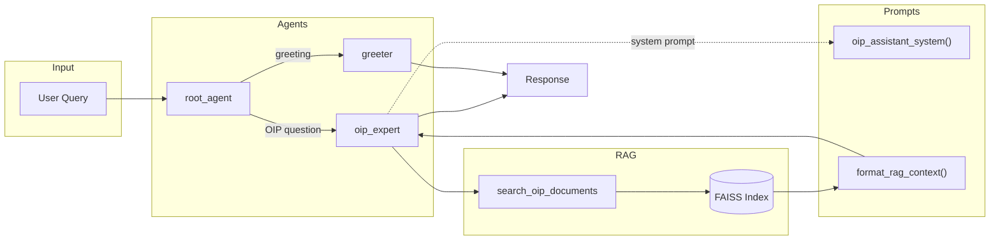

# Ebttikar OIP Assistant

A RAG-powered chatbot for the Ebttikar Operations Intelligence Platform (OIP) built with Google Agent Development Kit (ADK).

## Overview

This system uses Retrieval-Augmented Generation (RAG) to answer questions about the OIP platform by searching through internal documentation. Built with a modular, scalable architecture designed for future expansion.

### Key Features

- **Document-based Q&A**: Answers questions using SOW.pdf and Ebttikar_OIP_doc.docx
- **FAISS Vector Store**: Fast local similarity search
- **OpenRouter Integration**: Embeddings via `text-embedding-ada-002`
- **Google ADK**: Agent orchestration with A2A protocol support
- **Bilingual Support**: English and Arabic greetings

---

## Architecture

```
┌─────────────────────────────────────────────────────────────┐
│                      User Query                              │
└─────────────────────────────────────────────────────────────┘
                            │
                            ▼
┌─────────────────────────────────────────────────────────────┐
│                 root_agent (Coordinator)                     │
│                    Google ADK LlmAgent                       │
└─────────────────────────────────────────────────────────────┘
                            │
            ┌───────────────┴───────────────┐
            ▼                               ▼
┌─────────────────────┐         ┌─────────────────────┐
│      greeter        │         │     oip_expert      │
│   (Greetings)       │         │   (RAG Q&A)         │
└─────────────────────┘         └─────────────────────┘
                                            │
                                            ▼
                                ┌─────────────────────┐
                                │ search_oip_documents│
                                │      (Tool)         │
                                └─────────────────────┘
                                            │
                                            ▼
                                ┌─────────────────────┐
                                │   FAISS Index       │
                                │  (Vector Store)     │
                                └─────────────────────┘
```

### Prompt Workflow (Mermaid)



> **See [PROMPTS.md](PROMPTS.md) for detailed prompt documentation and customization guide.**

---

## Directory Structure

```
Ticketing Chatbot/
├── .env                      # API keys (OPENROUTER, GOOGLE, TAVILY)
├── requirements.txt          # Python dependencies
├── README.md                 # This file
├── PROMPTS.md                # Prompt templates documentation
├── IMPLEMENTATION_PLAN.md    # Detailed implementation plan
│
├── docs/                     # Knowledge base documents
│   ├── SOW.pdf               # Statement of Work
│   └── Ebttikar_OIP_doc.docx # OIP documentation
│
├── data/
│   └── faiss_index/          # Persisted vector index
│       ├── index.faiss       # FAISS index file
│       └── metadata.json     # Chunk metadata and texts
│
├── scripts/
│   └── ingest_documents.py   # CLI to ingest docs into FAISS
│
└── my_agent/                 # Main agent package
    ├── __init__.py           # Exports root_agent
    ├── agent.py              # Agent definitions (greeter, oip_expert)
    ├── config.py             # Centralized configuration
    ├── models.py             # Pydantic data models
    │
    ├── prompts/              # Prompt templates
    │   ├── __init__.py
    │   └── templates.py      # All prompts with f-string parameters
    │
    ├── helpers/              # Reusable utility functions
    │   ├── __init__.py
    │   ├── openrouter.py     # OpenRouter API client (embeddings, LLM)
    │   └── document_loader.py# PDF/DOCX text extraction
    │
    ├── rag/                  # RAG components
    │   ├── __init__.py
    │   ├── chunker.py        # Semantic document chunking
    │   └── vector_store.py   # FAISS index operations
    │
    └── tools/                # Agent tools
        ├── __init__.py
        └── rag_tool.py       # search_oip_documents function
```

### Why This Structure?

| Directory | Purpose |
|-----------|---------|
| `prompts/` | Isolated prompt templates - easy to modify without touching code |
| `helpers/` | Reusable functions (API clients, loaders) - no duplication |
| `rag/` | RAG-specific components - chunking, embeddings, retrieval |
| `tools/` | Agent tools - each tool in its own file for scalability |
| `scripts/` | CLI utilities - ingestion, maintenance scripts |

---

## Setup

### Prerequisites

- Python 3.10+
- OpenRouter API key
- Google API key (for Gemini)

### 1. Clone and Navigate

```bash
cd "Ticketing Chatbot"
```

### 2. Create Virtual Environment

```bash
# Windows
python -m venv venv
venv\Scripts\activate

# Linux/Mac
python -m venv venv
source venv/bin/activate
```

### 3. Install Dependencies

```bash
pip install -r requirements.txt
```

### 4. Configure Environment

Create or verify `.env` file:

```env
GOOGLE_API_KEY=your_google_api_key
OPENROUTER_API_KEY=your_openrouter_api_key
TAVILY_API_KEY=your_tavily_api_key  # Optional
```

### 5. Ingest Documents

This processes your docs, chunks them, generates embeddings, and saves to FAISS:

```bash
python scripts/ingest_documents.py
```

Expected output:
```
============================================================
OIP Document Ingestion Pipeline
============================================================

[1/5] Validating configuration...
  OK - API keys found

[2/5] Initializing components...
  Chunk size: 500 chars
  Overlap: 50 chars

[3/5] Loading documents from docs...
Loaded: SOW.pdf
Loaded: Ebttikar_OIP_doc.docx
  Loaded 2 documents

[4/5] Chunking documents...
  Created XX chunks

[5/5] Generating embeddings...
  Batch 1/X complete
  ...

INGESTION COMPLETE
============================================================
Documents processed: 2
Chunks created: XX
Vectors stored: XX
```

### 6. Run the Agent

```bash
adk web my_agent
```

> **Note:** Specify the agent folder name (`my_agent`) to prevent ADK from listing other directories (like `data`, `docs`, `scripts`, `venv`) in the agent dropdown.

Open browser at `http://localhost:8000`

---

## Usage

### Example Queries

**Greetings:**
- "Hello"
- "Marhaba"
- "Hi there"

**OIP Questions:**
- "What is the OIP platform?"
- "Explain the SOW deliverables"
- "What features does OIP have?"
- "Tell me about the implementation timeline"

---

## Configuration

All settings are in `my_agent/config.py`:

```python
# Chunk settings
RAGConfig.CHUNK_SIZE = 500      # Characters per chunk
RAGConfig.CHUNK_OVERLAP = 50    # Overlap between chunks

# Retrieval settings
RAGConfig.DEFAULT_TOP_K = 5     # Results to return
RAGConfig.SIMILARITY_THRESHOLD = 0.3  # Minimum score

# Models
DEFAULT_EMBEDDING_MODEL = "openai/text-embedding-ada-002"
DEFAULT_LLM_MODEL = "openai/gpt-4o-mini"
DEFAULT_AGENT_MODEL = "gemini-2.5-flash"
```

---

## Adding New Documents

1. Add PDF/DOCX files to `docs/` folder
2. Re-run ingestion:
   ```bash
   python scripts/ingest_documents.py
   ```

---

## Adding New Tools

1. Create tool function in `my_agent/tools/new_tool.py`
2. Export from `my_agent/tools/__init__.py`
3. Add to agent in `my_agent/agent.py`

Example:
```python
# my_agent/tools/chart_tool.py
def generate_chart(data: dict, chart_type: str) -> dict:
    """Generate a chart from data."""
    # Implementation
    return {"status": "success", "chart_url": "..."}
```

---

## Tech Stack

| Component | Technology |
|-----------|------------|
| Agent Framework | Google ADK (Agent Development Kit) |
| Vector Store | FAISS (faiss-cpu) |
| Embeddings | OpenRouter (text-embedding-ada-002) |
| LLM | Google Gemini 2.5 Flash |
| Data Validation | Pydantic v2 |
| Document Parsing | PyMuPDF, python-docx |

---

## Troubleshooting

### "FAISS index not found"

Run the ingestion script first:
```bash
python scripts/ingest_documents.py
```

### "OPENROUTER_API_KEY not found"

Ensure `.env` file exists with valid API key.

### Import errors

Make sure you're in the virtual environment:
```bash
venv\Scripts\activate  # Windows
source venv/bin/activate  # Linux/Mac
```

---

## Windows Installation Issues

Windows users may encounter DLL and wheel compatibility issues. Here are the common problems and fixes:

### NumPy wheel mismatch (`No module named 'numpy._core._multiarray_umath'`)

This happens when pip installs a wheel compiled for the wrong Python version.

```powershell
pip uninstall numpy -y
pip install --force-reinstall --no-cache-dir "numpy>=1.25.0,<2.5"
```

### FAISS DLL load failed (`ImportError: DLL load failed while importing _swigfaiss`)

FAISS has native C++ dependencies that can fail on Windows.

```powershell
pip uninstall faiss-cpu -y
pip install --force-reinstall --no-cache-dir faiss-cpu
```

### rpds-py import error (`No module named 'rpds.rpds'`)

The `rpds-py` package is Rust-based and can have corrupted installs.

```powershell
pip uninstall rpds-py referencing jsonschema -y
pip install --force-reinstall --no-cache-dir rpds-py referencing jsonschema
```

### pywin32 DLL errors

```powershell
pip uninstall pywin32 -y
pip install pywin32
python -c "import win32api; print('pywin32 OK')"
```

### Nuclear Option: Fresh Virtual Environment

If multiple packages are broken, recreate the venv:

```powershell
deactivate
rmdir /s /q venv
python -m venv venv
venv\Scripts\activate
pip install --upgrade pip
pip install -r requirements.txt
```

### Verify All Dependencies Work

```powershell
python -c "import numpy; print(f'numpy {numpy.__version__}')"
python -c "import faiss; print('faiss OK')"
python -c "from docx import Document; print('python-docx OK')"
python -c "import fitz; print(f'PyMuPDF {fitz.version}')"
python -c "from google.adk.agents import LlmAgent; print('google-adk OK')"
```

---

## API Deployment (For Frontend Integration)

Instead of using `adk web`, you can run the agent as a REST API server.

### Run API Server Locally

```bash
# Option 1: Using uvicorn directly
uvicorn main:app --host 0.0.0.0 --port 8080

# Option 2: Using python
python main.py
```

Server runs at `http://localhost:8080`

### API Endpoints

| Endpoint | Method | Description |
|----------|--------|-------------|
| `/run_sse` | POST | Execute agent (main endpoint) |
| `/health` | GET | Health check |
| `/list-apps` | GET | List available agents |

### Example: Query the Agent

```bash
curl -X POST http://localhost:8080/run_sse \
  -H "Content-Type: application/json" \
  -d '{
    "appName": "my_agent",
    "userId": "user_123",
    "sessionId": "session_abc",
    "newMessage": {
      "role": "user",
      "parts": [{"text": "What is OIP?"}]
    },
    "streaming": false
  }'
```

### Example: Streaming Response (SSE)

```bash
curl -X POST http://localhost:8080/run_sse \
  -H "Content-Type: application/json" \
  -d '{
    "appName": "my_agent",
    "userId": "user_123",
    "sessionId": "session_abc",
    "newMessage": {
      "role": "user",
      "parts": [{"text": "Explain the ticketing system"}]
    },
    "streaming": true
  }'
```

### Frontend Integration (JavaScript)

```javascript
// Non-streaming
const response = await fetch('http://localhost:8080/run_sse', {
  method: 'POST',
  headers: { 'Content-Type': 'application/json' },
  body: JSON.stringify({
    appName: 'my_agent',
    userId: 'user_123',
    sessionId: 'session_abc',
    newMessage: {
      role: 'user',
      parts: [{ text: 'What is OIP?' }]
    },
    streaming: false
  })
});
const data = await response.json();
console.log(data.content.parts[0].text);
```

### Deploy to Cloud Run

```bash
# Build and deploy
gcloud builds submit --tag gcr.io/YOUR_PROJECT_ID/oip-agent
gcloud run deploy oip-agent \
  --image gcr.io/YOUR_PROJECT_ID/oip-agent \
  --platform managed \
  --region us-central1 \
  --allow-unauthenticated \
  --set-env-vars GOOGLE_API_KEY=xxx,OPENROUTER_API_KEY=xxx
```

---

## Future Enhancements

- [ ] Hybrid search (BM25 + vector)
- [ ] Chart generation tool
- [ ] Conversation memory
- [ ] Document update detection
- [ ] Multi-language embeddings

---

## License

Internal use - Ebttikar Technology
